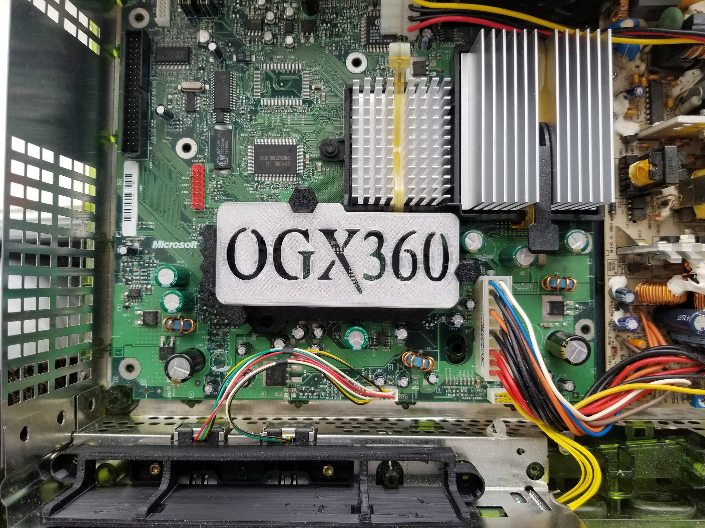

# 3D Printed Caddy

## Overview

The caddy was designed by TEK Nemesis and it is used to hold the ogx360 in place (inside the Xbox).  The caddy isn't necessary but it has a unique look and it properly secures the ogx360 from moving around.

Note:  The Philips DVD Drive has a big bulge on the bottom that interferes with this caddy.  The Philips drive can be swapped with any other DVD drive that comes with the Xbox.

 
