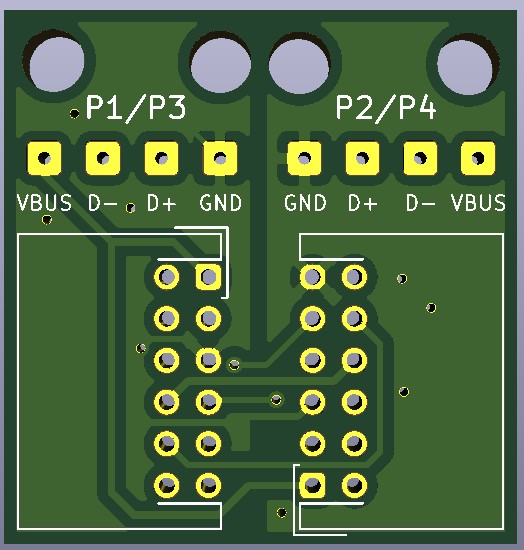

# USB Breakout Board (by TEK Nemesis)

## Overview

* This PCB was designed by TEK Nemesis. It uses Micro USB cables (cut open at one end) and 12-pin JST 2.00mm cables.  Zip ties / cable ties (optional) hold the wires nicely in place.
* This design allows for better cable management and routing.
* The Micro USB cable is soldered to the PCB like this (though it is possible to have alternate wire colours):
  - red wire to VBUS
  - black wire to GND
  - green wire to D+
  - white wire to D-
* Note that there are markings on the PCB to indicate the Controller Port:  P1/P3, P2/P4.  Plug the Micro USB cable into the appropriate Micro USB port on the ogx360.  I find it handy to add a little heatshrink band to the Micro USB cable that is for P1/P3.

 

 

## BOM

| Qty | Part Number             | Manufacturer              | Description                        | DigiKey Part        |
|-----|-------------------------|---------------------------|------------------------------------|---------------------|
| 2   | S12B-PHDSS(LF)(SN)      | JST Sales America Inc.    | CONN HEADER R/A 12POS 2MM          | 	455-1776-ND        |
| 1   | CABLE                   | JST Sales America Inc.    | PHD 2.0MM 26AWG CABLE, REVERSED    | 	N/A                |

There is lots of stock of the 12-pin connection header on AliExpress:
https://www.aliexpress.com/wholesale?catId=0&initiative_id=SB_20210608224931&SearchText=S12B-PHDSS

AliExpress also has lots of the short PHD 2.0mm 26AWG cables (reversed):
https://www.aliexpress.com/wholesale?catId=0&initiative_id=SB_20210608225500&SearchText=PHD+2.0mm+26awg

 

Here's the new USB Breakout board with the new 3D printed case:

 
