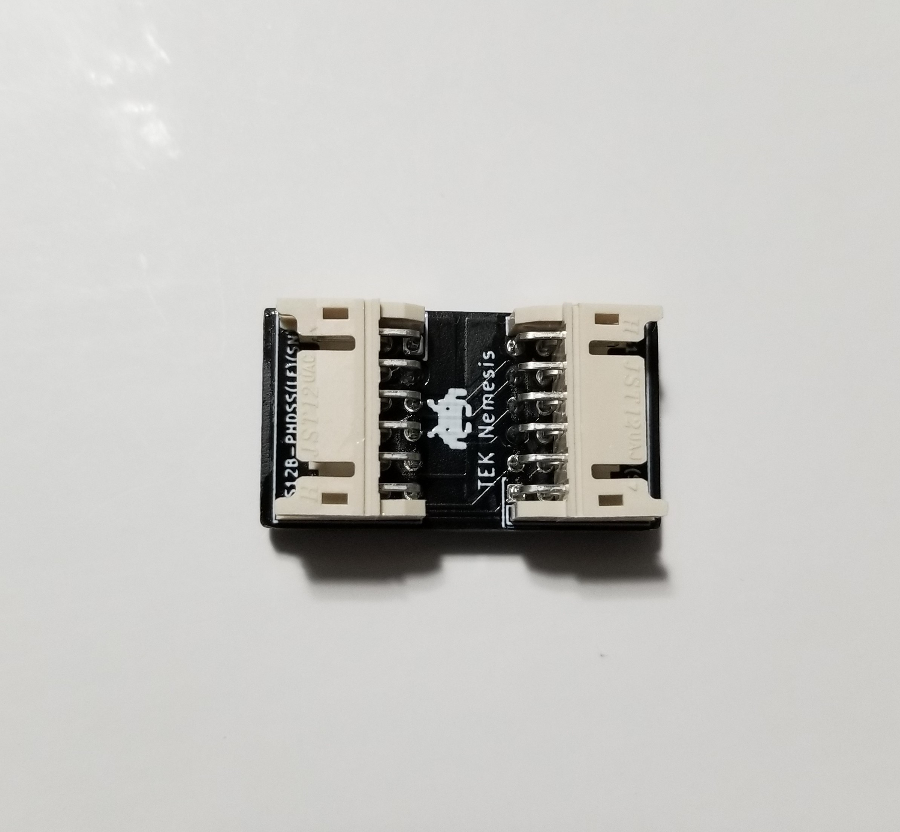
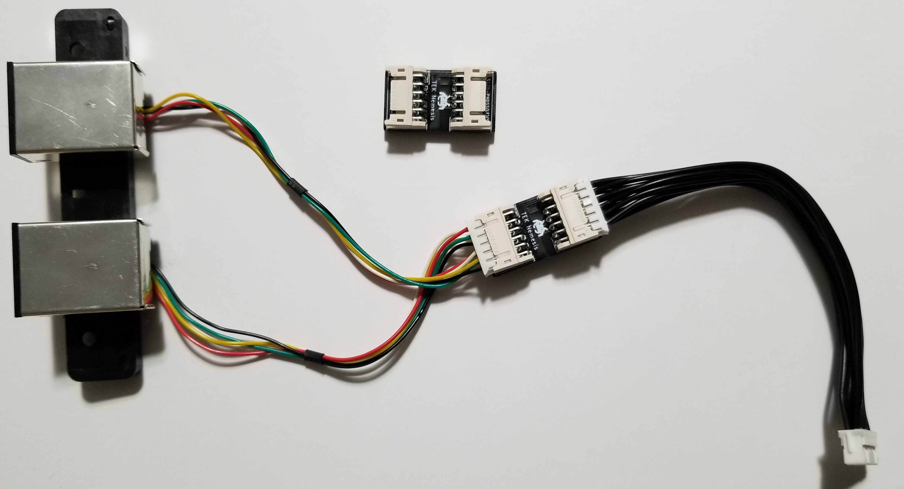

# Motherboard 12-pin Extension

## Overview

 

## BOM

| Qty | Part Number             | Manufacturer              | Description                 | DigiKey Part        |
|-----|-------------------------|---------------------------|-----------------------------|---------------------|
| 2   | S12B-PHDSS(LF)(SN)      | JST Sales America Inc.    | CONN HEADER R/A 12POS 2MM   | 	455-1776-ND       |

This utility PCB plugs has many uses but it is mostly used for extending the controller port plug further away from the controller port. 

 
