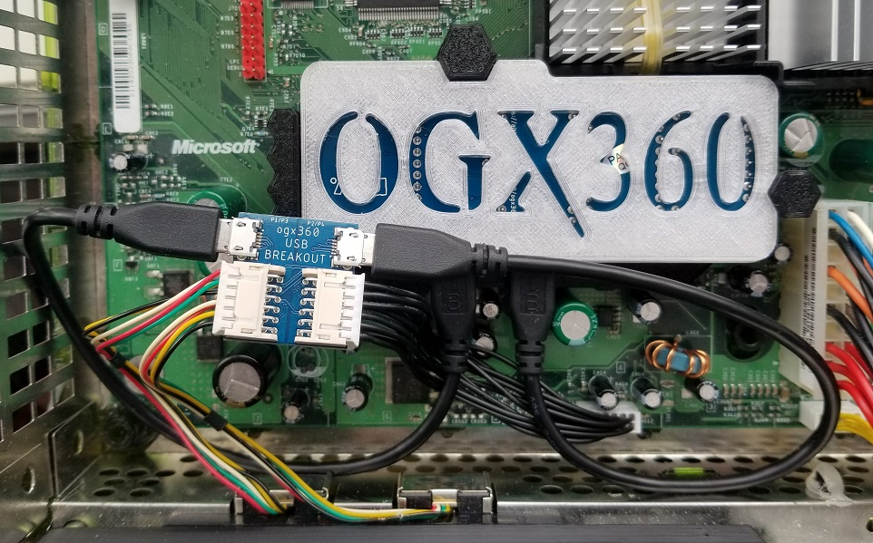

# USB Breakout Board (by RYZEE119)

## Overview

The PCB was designed by RYZEE119 and the STL was designed by TEK Nemesis.  The PCB uses Micro USB to Micro USB cables and 12-pin JST cables.

## BOM

| Qty | Part Number             | Manufacturer              | Description                        | DigiKey Part        |
|-----|-------------------------|---------------------------|------------------------------------|---------------------|
| 2   | S12B-PHDSS(LF)(SN)      | JST Sales America Inc.    | CONN HEADER R/A 12POS 2MM          | 	455-1776-ND        |
| 2   | 10118193-0001LF         | Amphenol ICC (FCI)        | CONN RCPT USB2.0 MICRO B SMD R/A   | 	609-4616-1-ND      |

 

Once installed, it will look like the image below.  The 3D printed part may be used or the USB Breakout Board may be affixed to the interior of the Xbox with double-sided tape.

 
