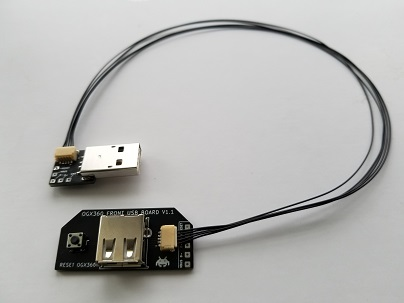
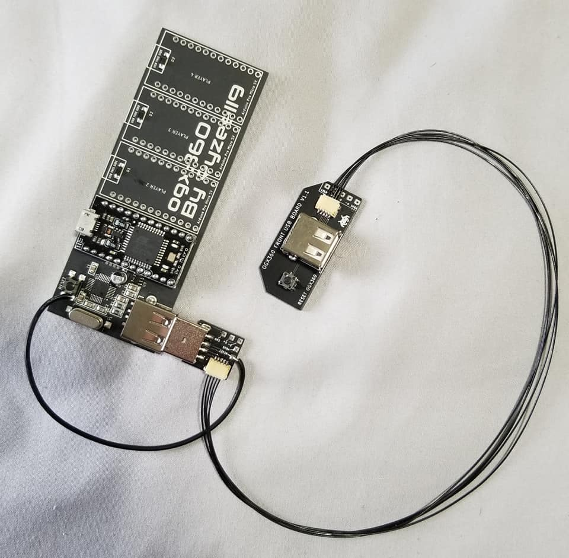

# USB Extender

## Overview

The USB Extender simply extends the USB port on the ogx360, bringing a USB port to the front of the Xbox.  

 

## Usage

The installation of a tactile switch on the Front USB PCB is optional but it may prove useful (perhaps when switching from wired to wireless controllers).  If used, here is what must be done:

  * If you **are** using a JST cable to connect the two USB Extender PCBs then you simply need to solder one end of a wire (e.g. 28 AWG multi-stranded) to the **reset** solder pad on the USB Plug PCB (that plugs directly into the ogx360).  The other end of the wire gets soldered to one of two inside pads of the tactile switch (that is soldered onto the ogx360).  Refer to the picture below.

  * If you **are not** using a JST cable to connect the two USB Extender PCBs then you will run one single wire (e.g. 28 AWG multi-stranded) from the **reset** solder pad on the Front USB PCB to one of two inside pads of the tactile switch (that is soldered onto the ogx360).  Refer to the picture below.
 
Note:  If everything is connected and the ogx360 doesn't reset then solder the reset wire to a different pad on the ogx360's tactile switch.  

A 5-pin 1.00mm pitch JST cable is used to connect the two parts (although you may also wire directly to the solder pads.)

 

## Gerber files

<b>USB 2.0 Plug for ogx360.zip</b> - plugs directly into the ogx360 USB Port.  A 5-pin cable runs out to the Front USB piece.  (Optionally, single wires may be used.)

<b>OGX360 Front USB PCB_Gerber Files (Type A).zip</b> - this PCB gets mounted outside the case, centred under the power/eject buttons.  Use double-sided tape to secure it.  5-pin connector points to <b>side</b>.   

<b>OGX360 Front USB PCB_Gerber Files (Type B).zip</b> - this PCB gets mounted outside the case, centred under the power/eject buttons.  Use double-sided tape to secure it.  5-pin connector points to <b>rear</b>.   

